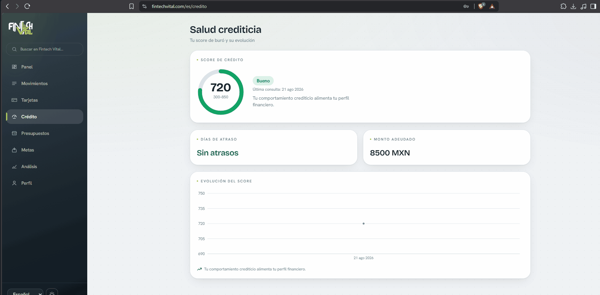

### Entiende en qué se te va el dinero, y qué hacer al respecto


**Web · Móvil · API · Base de datos — todo en contenedores.**
Español 🇪🇸 · Português 🇧🇷 · English 🇺🇸

**🟢 [En vivo: fintechvital.com](https://fintechvital.com)** · API en [api.fintechvital.com](https://api.fintechvital.com/api/v1/salud)

*Hackathon ONE G9 (Alura + Oracle) — No Country, equipo 65*

---

## 📋 Sumario

- [Qué hace](#-qué-hace)
- [Identidad Visual](#-identidad-visual)
- [Demo](#-demo)
- [Funcionalidades](#-funcionalidades)
- [Arquitectura](#️-arquitectura)
- [Tecnologías](#️-tecnologías)
- [Cómo Rodar](#-cómo-rodar)
- [Estructura del Proyecto](#-estructura-del-proyecto)
- [Estado por Módulo](#-estado-por-módulo)
- [API Endpoints](#-api-endpoints)
- [Machine Learning](#-machine-learning)
- [Modelo de Datos](#️-modelo-de-datos)
- [Documentación Completa](#-documentación-completa)
- [Integrantes](#-integrantes)

---

## 🎯 Qué hace

A partir de tus movimientos bancarios, **Fintech Vital**:

1. **Clasifica** cada transacción en una de **12 categorías**, leyendo su descripción.
2. **Calcula 8 indicadores** de salud financiera (tasa de ahorro, endeudamiento, gasto esencial, concentración del gasto…).
3. **Te asigna un perfil**: `saludable` · `en_observacion` · `en_riesgo`.
4. **Te da recomendaciones concretas**, generadas por un **motor de reglas determinista** — no por un modelo de lenguaje. Cada consejo se puede explicar y auditar hasta la línea de código exacta que lo produjo.
5. **Te muestra tu evolución** en el tiempo, no solo una foto del mes.

**Lo que no hace**: no se conecta a bancos reales, no mueve dinero, no da asesoría financiera regulada y no inventa recomendaciones con un LLM.

### 🏆 Destaques

- 🤖 **Dos modelos de ML entrenados y en producción** (no placeholders): un clasificador de transacciones y un predictor de perfil financiero
- 📏 **Recomendaciones explicables por diseño**: reglas deterministas, auditables línea por línea — decisión de arquitectura documentada en el [ADR-0007](https://github.com/No-Country-simulation/fintech-vital-equipo65/blob/main/docs/adr)
- 🌎 **Trilingüe de verdad**: interfaz **y** modelo de clasificación entrenados en es/pt/en (`IFOOD *PEDIDO`, `Aluguel`, `Payroll deposit` se clasifican igual de bien)
- 📱 **Web + móvil** con la misma capa de datos, sin duplicar lógica
- 🔐 **Autenticación con JWT + 2FA (TOTP)** de verdad, no simulada
- 🌐 **Desplegado en producción** sobre Oracle Cloud (OCI), detrás de un túnel de Cloudflare

---

## 🎨 Identidad Visual

El corazón verde de Fintech Vital nace de un imagotipo vectorizado en **Adobe Illustrator**.

**Imagotipo principal** (logo completo — portadas, encabezados, presentaciones)


**Logotipo circular** (favicon — el ícono que aparece en la pestaña del navegador)


> Archivos fuente (`.svg`, editables) en [`frontend/docs/branding/`](https://github.com/No-Country-simulation/fintech-vital-equipo65/tree/main/frontend/docs/branding).

---

## 🎬 Demo

### 📸 Capturas (Registro)


| Registro Fase 2 | Registro Fase 3| Registro Fase 4|
|---|---|---|
|  |  |  |

---

### 🎥 Videos demostrativos


**Panel + Movimientos**  


<br/><br/>

**Tarjetas + Crédito**  


<br/><br/>

**Presupuestos + Metas**  


<br/><br/>

**Análisis + Perfil financiero**  


<br/><br/>

**Selector de idioma y modo oscuro**  


</div>
## ✨ Funcionalidades

Lo que ya está construido y corriendo contra la API real (no datos mock — la capa mock se retiró, [ADR-0011](https://github.com/No-Country-simulation/fintech-vital-equipo65/blob/main/docs/adr)):

- **Registro / login** con **2FA opcional (TOTP)**, códigos de respaldo
- **Panel** con perfil financiero, gastos por categoría (dona/barras) e indicadores
- **Movimientos**: alta manual, **importación por CSV** y corrección de categoría
- **Presupuestos** por categoría y **metas de ahorro**
- **Análisis** con recomendaciones — y qué indicador exacto disparó cada una
- **Evolución temporal** del perfil y **comparación mensual** (`/resumen/comparacion`)
- **Calendario de pagos** (eventos)
- **Multi-moneda**, con tasa de cambio por fecha del movimiento (no la del día de hoy)
- **Selector de idioma** (es/pt/en) y **modo oscuro**
- **Exportación de datos** y **eliminación de cuenta**
- Términos, privacidad y licencias trilingües

---

## 🏗️ Arquitectura

| Capa | Tecnología | Rol |
| --- | --- | --- |
| **Web** | Next.js 15 | Dashboard del usuario |
| **Móvil** | React Native + Expo | App Android (y web en pantalla de teléfono) |
| **API** | Java 21 + Spring Boot 3 | Única pieza que habla con la BD y con el ML. Toda la lógica de negocio vive aquí |
| **Servicio de ML** | Python 3.11 + FastAPI | Inferencia pura. No se expone a internet — solo lo llama la API |
| **Base de datos** | PostgreSQL 16 | 30 tablas, 10 vistas |

```
Web (Next.js)  ─┐
                ├──►  API (Spring Boot)  ──►  PostgreSQL 16
Móvil (Expo)   ─┘            │
                             └──────────►  Servicio de ML (FastAPI)
                                           clasifica + predice perfil
```

### Tres reglas que explican casi todas las decisiones del proyecto

- **El servicio de ML no tiene lógica de negocio.** Recibe características, devuelve predicciones. Los indicadores, las reglas y la persistencia viven en la API — así el modelo se puede reentrenar sin tocar el negocio.
- **El modelo trabaja con ratios, no con importes.** Por eso funciona igual con pesos, reales o dólares: la moneda se cancela sola en la división.
- **Los identificadores nunca se traducen; el texto para humanos, siempre.** En la base de datos y en la API viaja `en_observacion`; *"En observación"*, *"Em observação"* o *"Under observation"* se resuelven al mostrarlo.

### Cómo se produce un análisis

```
1. ML   POST /interno/v1/clasificar   -> categoría de cada transacción
2. API  agrega los montos por categoría        -> resumen_gastos
3. API  calcula los 8 indicadores               -> ratios
4. ML   POST /interno/v1/perfil        -> perfil + probabilidades
5. API  motor de reglas sobre los indicadores   -> recomendaciones
6. API  responde
```

Los pasos 3 y 5 viven en la API a propósito: el ML es inferencia pura. Si el servicio de ML no responde, la API devuelve **503** — nunca una predicción inventada.

---

## 🛠️ Tecnologías

### Frontend

| Tecnología | Uso |
| --- | --- |
| Next.js **15.5.20** · React **19.1** · TypeScript **5** | Dashboard web |
| Tailwind CSS **4** | Estilos |
| next-intl **4.13** | Trilingüe (es/pt/en) |
| Recharts **3.9** | Gráficas (dona, barras, evolución) |
| Expo SDK **57** · React Native **0.86** · React **19.2** · Expo Router · TypeScript **6.0** | App móvil |

### Backend

| Tecnología | Uso |
| --- | --- |
| Java **21** | Lenguaje principal |
| Spring Boot **3** | Framework REST API |
| Spring Data JPA | Persistencia |
| Spring Security + JWT | Autenticación (JWT + refresh rotativo) |
| Swagger / OpenAPI | Documentación de la API (`/api/v1/docs`) |
| Maven | Build |

### Machine Learning

| Tecnología | Uso |
| --- | --- |
| Python **3.11** | Servicio de inferencia |
| FastAPI | API interna del modelo |
| scikit-learn | `TfidfVectorizer` + `LogisticRegression` (M1) · `RandomForest` (M2) |
| Jupyter Notebook | Entrenamiento, EDA y métricas, versionado y re-ejecutable |

### Datos

| Tecnología | Uso |
| --- | --- |
| PostgreSQL **16** | Motor de base de datos ([ADR-0014](https://github.com/No-Country-simulation/fintech-vital-equipo65/blob/main/docs/adr)) |
| Migraciones versionadas (convención Flyway) | Gobiernan el esquema — no Hibernate |

### Infraestructura

| Tecnología | Uso |
| --- | --- |
| Docker / Podman + Compose | Todo el stack en contenedores, un solo comando |
| Cloudflare Tunnel | Exposición segura del despliegue |
| Oracle Cloud (OCI): Compute ARM · Container Registry · Vault · Bastion | Producción |

### Diseño

| Herramienta | Uso |
| --- | --- |
| Adobe Illustrator | Vectorización del imagotipo y del logotipo circular (ver [Identidad Visual](#-identidad-visual)) |

---

## 🚀 Cómo Rodar

Necesitas **Docker o Podman**. Nada más.

```bash
git clone https://github.com/No-Country-simulation/fintech-vital-equipo65.git
cd fintech-vital-equipo65

./ops/stack.sh arriba        # Linux / macOS
.\ops\stack.ps1 arriba       # Windows
```

| Servicio | URL |
| --- | --- |
| 🌐 Web | <http://localhost:3000> |
| 🔌 API | <http://localhost:8080> |
| 📖 Swagger UI | <http://localhost:8080/api/v1/docs> |
| 🗄️ Base de datos | `localhost:5432` |

Para comprobar que todo funciona de verdad:

```bash
./ops/stack.sh probar
```

¿No estás seguro de que tu máquina tenga lo necesario? Hay un *doctor* que revisa todo y puede instalarte Podman si te falta:

```bash
./frontend/scripts/linux/verificar-requisitos.sh     # o macos/ · windows/
```

> 📖 Guía completa de operación: [`ops/README.md`](https://github.com/No-Country-simulation/fintech-vital-equipo65/blob/main/ops/README.md)
> 📖 Instalar solo el frontend desde cero: [`docs/FRONTEND_DESDE_CERO.md`](https://github.com/No-Country-simulation/fintech-vital-equipo65/blob/main/docs/FRONTEND_DESDE_CERO.md)

---

## 📁 Estructura del Proyecto

```
fintech-vital-equipo65/
├── frontend/               Web (Next.js 15) + móvil (React Native/Expo)
│   ├── web/                 Dashboard web
│   ├── mobile/               App Android
│   ├── capturas/            Screenshots reales usados en este README
│   ├── scripts/             Doctor y menú, por sistema operativo
│   └── docs/                Documentación propia del frontend (ADR, branding)
│       └── branding/         imagotipo.svg · logotipo-circular.svg
│
├── backend/                API REST — Java 21 + Spring Boot 3
│   └── src/main/java/com/fintechvital/api/
│       ├── controller/       AnalisisFinanciero · Auth · DosFactores · Usuario
│       │                     Banca · Transaccion · Categoria · Evento · Analisis
│       │                     Resumen · Metas · Presupuesto · Salud
│       ├── service/          AnalisisFinanciero · Indicadores · MotorReglas
│       │                     ClienteMl · Auth · Jwt · Totp · Cifrado · Auditoria
│       ├── dominio/          Taxonomia (12+3 slugs) e Indicadores — sin dependencias de Spring
│       ├── repository/       Spring Data JPA
│       ├── model/             Entidades JPA
│       ├── dto/                Entrada/salida de la API (las entidades nunca salen por HTTP)
│       ├── security/          JwtFiltro · UsuarioActual
│       ├── error/              Forma de error del contrato
│       └── config/             Security · Cors · I18n · OpenApi
│
├── ml/                      Servicio de inferencia — Python 3.11 + FastAPI
│   ├── app/                   main.py · inferencia.py · taxonomia.py · esquemas.py
│   ├── datos/                 comercios.py · generar_dataset.py · dataset_*.csv
│   ├── notebooks/             modelos_fintech_vital.ipynb (entrenamiento reproducible)
│   ├── artefactos/            modelo_clasificador_salud_financiera.pkl (M1)
│   │                          modelo_perfil_salud.pkl (M2)
│   └── tests/                 36 tests de costura con Spring
│
├── db/                      PostgreSQL 16
│   ├── migraciones/           V1__catalogos.sql ... V10__taxonomia_abierta.sql
│   ├── semillas/               demo.sql · dataset.sql · dataset/*.csv (100 usuarios reales)
│   ├── aplicar.sh              Aplica migraciones pendientes y las registra con SHA-256
│   └── initdb/                 Hook del primer arranque
│
├── ops/                     Stack completo en contenedores (compose + scripts)
├── docs/                    Documentación transversal: contratos, ADR, taxonomía,
│                            arquitectura, checklist de entrega, guion de demo
├── CHANGELOG.md
├── LICENSE
└── README.md
```

---

## ✅ Estado por Módulo

Medido el **2026-08-20** levantando el stack entero, en navegador real y desplegado en OCI — no es una estimación.

| Módulo | Estado |
| --- | --- |
| **Base de datos** | ✅ 30 tablas · 10 migraciones · semilla y dataset propio |
| **Operación / contenedores** | ✅ Un comando levanta todo. Verificado con Docker **y** Podman |
| **Frontend** (web + móvil) | ✅ Completo, contra la API real — la capa mock ya se retiró |
| **API** | ✅ Completa para todo lo que consumen las interfaces. Solo falta `GET /auditoria` (🔒 admin, sin uso en pantalla) |
| **Modelo (ML)** | ✅ M1 y M2 entrenados y en uso, con notebook y dataset propios |
| **Despliegue** | ✅ En producción sobre Oracle Cloud (OCI): <https://fintechvital.com> |

**Probado de punta a punta**: contrato **35/35** y navegador **51/51** (escritorio y móvil-web) + `ops/ejemplos.mjs` **54/54** contra la API de producción.

---

## 📡 API Endpoints

Base local: `http://localhost:8080` · Swagger: `/api/v1/docs` · especificación OpenAPI en `/api/v1/openapi.json` (se genera desde el código, nunca se desincroniza).

### Los dos endpoints del enunciado (públicos, sin token)

```bash
curl -X POST http://localhost:8080/analisis-financiero \
  -H 'Content-Type: application/json' \
  -d '{
    "ingreso_mensual": 4500,
    "nivel_endeudamiento": 25,
    "frecuencia_ahorro": "Media",
    "transacciones": [
      { "descripcion": "Supermercado", "valor": 420 },
      { "descripcion": "Combustible",  "valor": 300 },
      { "descripcion": "Streaming",    "valor": 40 }
    ]
  }'
```

Responde igual en `/api/v1/analisis-financiero` y en `/analisis-financiero`. Los cuatro primeros campos de la respuesta (`perfil_financiero`, `probabilidad`, `resumen_gastos`, `recomendaciones`) son literales del enunciado; el resto son extensiones aditivas (`perfil_codigo`, `indicadores`, `transacciones_clasificadas`, `recomendaciones_detalle`).

| Método | Endpoint | Descripción |
| --- | --- | --- |
| `POST` | `/analisis-financiero` | Análisis financiero completo (endpoint del enunciado) |
| `POST` | `/api/v1/transacciones/clasificar` | Clasifica transacciones sin diagnosticar |

> Cabecera `Accept-Language: es \| pt \| en` para el idioma de la respuesta (por defecto `es`). Los slugs (`en_riesgo`, etc.) **nunca** se traducen.

### Resto de la API (autenticadas)

| Bloque | Estado |
| --- | --- |
| Autenticación y sesión (JWT + refresh rotativo) | ✅ |
| 2FA TOTP (alta, códigos de respaldo, login) | ✅ |
| Perfil, exportación de datos y baja de cuenta | ✅ |
| Banca (cuentas, tarjetas, buró) | ✅ |
| Transacciones (CRUD + importar CSV) | ✅ |
| Análisis persistido, historial y evolución | ✅ |
| Catálogos (`/categorias`, `/monedas`, `/ciudades`) | ✅ |
| Metas, presupuestos, eventos y `/resumen/comparacion` | ✅ |
| `GET /auditoria` (🔒 admin) | ⏳ pendiente — ninguna pantalla lo usa |

> La forma exacta de cada ruta está en [`docs/arquitectura/CONTRATO_API.md`](https://github.com/No-Country-simulation/fintech-vital-equipo65/blob/main/docs/arquitectura/CONTRATO_API.md) y en el Swagger.

### Convenciones de la API

- **Dinero**: `BigDecimal` — nunca `double` ni `float`
- **JSON**: `snake_case`
- **Slugs**: minúscula, sin acentos, nunca se traducen
- **Fechas**: ISO-8601, UTC
- **Entidades JPA**: no salen por HTTP

---

## 🤖 Machine Learning

Dos modelos entrenados y en uso — todo el proceso (datos, EDA, entrenamiento, métricas y serialización) está en [`ml/notebooks/modelos_fintech_vital.ipynb`](https://github.com/No-Country-simulation/fintech-vital-equipo65/blob/main/ml/notebooks/modelos_fintech_vital.ipynb), reproducible.

### M1 — Clasificador de categorías

```
Pipeline
 ├─ features: FeatureUnion
 │    ├─ word_tfidf: TfidfVectorizer(analyzer=word,    ngram=(1,2))
 │    └─ char_tfidf: TfidfVectorizer(analyzer=char_wb, ngram=(3,5))
 └─ classifier: LogisticRegression(class_weight="balanced")
```

Recibe la descripción cruda de una transacción y devuelve uno de los **12 slugs** con `predict_proba`. Si `predict_proba < 0.40`, cae a un baseline por palabras clave (cubre comercios que el modelo nunca vio).

| Escenario | macro-F1 |
| --- | --- |
| Comercio ya conocido (escrito distinto) | 1.00 |
| Comercio completamente nuevo (solo modelo) | 0.58 |
| Comercio nuevo (modelo + baseline, lo que corre en producción) | 0.60 |

Entrenado y evaluado en **es/pt/en** — `IFOOD *PEDIDO` → `alimentacion` (0.93), `PIX RECEBIDO SALARIO` → `ingresos` (1.00), `CONTA DE LUZ ENEL` → `servicios` (0.99).

### M2 — Perfil financiero

`RandomForest` sobre **los 8 indicadores** del contrato de datos.

| Métrica | Valor |
| --- | --- |
| macro-F1 | **0.89** (meta del contrato: 0.80) |
| Baseline (regla determinista) | 0.80 |
| Predice las 3 clases | Sí — `saludable` con F1 0.96 |

M2 manda siempre, con la regla determinista como red de seguridad si el modelo no carga o falla la inferencia. Nunca se inventa un perfil.

### Endpoints del servicio de ML (internos, no expuestos a internet)

| Método | Ruta | Qué hace |
| --- | --- | --- |
| `POST` | `/interno/v1/clasificar` | Categoría de cada descripción (máx. 500) |
| `POST` | `/interno/v1/perfil` | Perfil a partir de los 8 indicadores |
| `GET` | `/interno/v1/salud` | Estado del servicio; **503** si un artefacto no cargó |
| `GET` | `/interno/v1/categorias` | Slugs que este servicio puede devolver |
| `GET` | `/interno/v1/docs` | Swagger del servicio de ML |

### Reentrenar

```bash
cd ml/datos && python generar_dataset.py
cd ../notebooks
python construir_notebook.py
python -m nbconvert --execute --inplace --to notebook modelos_fintech_vital.ipynb
```

---

## 🗄️ Modelo de Datos

**30 tablas, 10 vistas** en PostgreSQL 16, repartidas en 10 migraciones versionadas.

| Grupo | Contenido |
| --- | --- |
| Catálogos | `idioma`, `moneda`, `tasa_cambio`, `ciudad`, `categoria` (12), `categoria_i18n` (36), `perfil`, `perfil_i18n` |
| Usuarios y seguridad | `usuario`, `usuario_seguridad`, `codigo_respaldo_2fa`, `refresh_token`, `intento_login`, `evento_auditoria` |
| Banca | `cuenta_bancaria`, `cuenta_usuario`, `tarjeta`, `tarjeta_credito`, `historial_buro` |
| Transacciones | `transaccion` (+ 34 `subcategoria`, con trigger de coherencia con la macro-categoría) |
| Análisis | `modelo_ia`, `analisis`, `recomendacion`, `resumen_mensual` |
| Producto | `plan_ahorro`, `aporte_plan`, `presupuesto`, `evento_calendario` |

### Decisiones clave del modelo

- **La transacción cuelga del usuario, no de la tarjeta** — así los pagos en efectivo no quedan huérfanos.
- **El signo es el dato**: `valor NUMERIC(14,2)` con signo (`> 0` ingreso, `< 0` gasto). `tipo_movimiento` es una columna generada por PostgreSQL, nunca puede desincronizarse.
- **Nada de etiquetas traducidas dentro de la BD** — las tablas devuelven slugs; las etiquetas legibles viven en `categoria_i18n` y `perfil_i18n`.
- **No se guarda el número de tarjeta completo** — solo los últimos 4 dígitos y un hash (evita alcance PCI-DSS).
- **Lo derivado no se almacena**: saldo de cuenta, saldo usado de tarjeta, ahorrado de una meta y gastado de un presupuesto se **calculan** en vistas.
- **Multi-moneda real**: `fn_a_base(monto, moneda, fecha)` convierte con la tasa **de la fecha del movimiento**, no la de hoy.

### Vistas principales

| Vista | Para qué |
| --- | --- |
| `vw_saldo_cuenta` | Saldo (no se almacena) |
| `vw_tarjeta_credito` | Límite, usado y disponible |
| `vw_gasto_mensual_categoria` | Base del gráfico de gastos |
| `vw_indicadores_mensuales` | Los 8 indicadores, contrastados contra los que calcula Spring |
| `vw_meta_progreso` | Avance de metas de ahorro |
| `vw_presupuesto_uso` | Gastado del mes en curso por presupuesto |
| `vw_buro_vigente` | Último registro de buró por usuario |

> Detalle completo, incluida la carga de datos de ejemplo y del dataset del equipo (100 usuarios / 4.885 movimientos reales): [`db/README.md`](https://github.com/No-Country-simulation/fintech-vital-equipo65/blob/main/db/README.md)

---

## 📚 Documentación Completa

| Si quieres… | Lee |
| --- | --- |
| Levantar y operar el proyecto | [`ops/README.md`](https://github.com/No-Country-simulation/fintech-vital-equipo65/blob/main/ops/README.md) |
| Entender la arquitectura | [`docs/ARQUITECTURA.md`](https://github.com/No-Country-simulation/fintech-vital-equipo65/blob/main/docs/ARQUITECTURA.md) |
| Trabajar en la base de datos | [`db/README.md`](https://github.com/No-Country-simulation/fintech-vital-equipo65/blob/main/db/README.md) |
| Trabajar en la API | [`backend/README.md`](https://github.com/No-Country-simulation/fintech-vital-equipo65/blob/main/backend/README.md) |
| Trabajar en el servicio de modelo | [`ml/README.md`](https://github.com/No-Country-simulation/fintech-vital-equipo65/blob/main/ml/README.md) |
| Trabajar en el frontend | [`frontend/README.md`](https://github.com/No-Country-simulation/fintech-vital-equipo65/blob/main/frontend/README.md) |
| Desplegar (staging y producción) | [`docs/DESPLIEGUE.md`](https://github.com/No-Country-simulation/fintech-vital-equipo65/blob/main/docs/DESPLIEGUE.md) |
| Los tres contratos (API, modelo, taxonomía) | [`docs/arquitectura/`](https://github.com/No-Country-simulation/fintech-vital-equipo65/blob/main/docs/arquitectura) |
| El porqué de cada decisión (15 ADR) | [`docs/adr/`](https://github.com/No-Country-simulation/fintech-vital-equipo65/blob/main/docs/adr) |
| El índice completo | [`docs/README.md`](https://github.com/No-Country-simulation/fintech-vital-equipo65/blob/main/docs/README.md) |

---

## 👥 Integrantes


<div align="center">
  <table>
    <tr>
      <td align="center" width="200">
        <a href="https://github.com/EzequielAngel0">
          <br />
          <sub><b>Angel Barbosa</b></sub>
        </a><br />
        <sub>Full Stack</sub><br /><br />
        <a href="https://www.linkedin.com/in/angelezequiel/">
          
        </a>
        <a href="https://github.com/EzequielAngel0">
          
        </a>
      </td>
      <td align="center" width="200">
        <a href="https://github.com/neri211">
          <br />
          <sub><b>Neri Rubio</b></sub>
        </a><br />
        <sub>Full Stack</sub><br /><br />
        <a href="https://www.linkedin.com/in/neri-rubio/">
          
        </a>
        <a href="https://github.com/neri211">
          
        </a>
      </td>
      <td align="center" width="200">
        <a href="https://github.com/MontseCoria00">
          <br />
          <sub><b>Montserrat Martinez</b></sub>
        </a><br />
        <sub>Data Scientist</sub><br /><br />
        <a href="https://www.linkedin.com/in/montserrat-coria-mart%C3%ADnez-954749242/">
          
        </a>
        <a href="https://github.com/MontseCoria00">
          
        </a>
      </td>
      <td align="center" width="200">
        <a href="https://github.com/Dsx-Dev">
          <br />
          <sub><b>Daniel Caro</b></sub>
        </a><br />
        <sub>Backend / designer</sub><br /><br />
        <a href="https://www.linkedin.com/in/daniel-caro-dsx/">
          
        </a>
        <a href="https://github.com/Dsx-Dev">
          
        </a>
      </td>
    </tr>
  </table>
</div>

---

## 📄 Licencia

MIT — ver [`LICENSE`](https://github.com/No-Country-simulation/fintech-vital-equipo65/blob/main/LICENSE).

---

Hecho con 💚 por el equipo **Fintech Vital** — Hackathon ONE G9 (Alura + Oracle), No Country, equipo 65.

[def]: inte